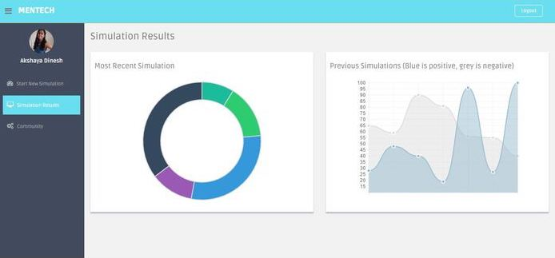

# MentalTech
VR + Web App that uses exposure therapy to help individuals with anxiety. Received the Linode API prize at Hack the North 2016.

## Website Screen Shots
\
\

## Reflection

This project was inspired by the anxiety we experienced on a daily basis, whether it was during public speaking or job interviews. Using Unity, we created a VR simulation, based on exposure therapy, that simulates an anxiety-inducing situaiton (like a job interview). We then developed a web app where user's could login (login system used Firebase) and then they would be prompted to answer a few questions while in the VR simulation. Based on their responses to the questions, we used Google's speech-to-text API and sentiment analysis API to detect their anxiety levels. We then displayed their anxiety levels over time on a graph available in their dashboard. We also provided resources to trusted websites that gave tips/advice on how to combat anxiety.
